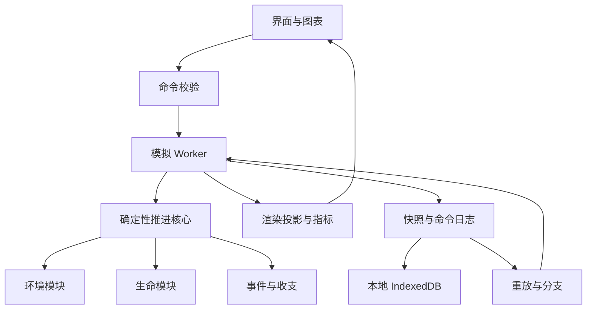

# 我的宇宙：详细设计方案

- 版本：0.2（2026-09-06 增补空间场景生成设计）
- 日期：2026-09-05
- 状态：生态 MVP 已通过 P0—P6 阶段综合审核；阶段证据与设计偏差见 [进度与验收](进度与验收.md)。本文保留原设计目标，实际交付范围以验收报告为准。
- 上位文档：[构建与实现方案](01-项目方案.md)
- 首版代号：一颗行星，两条历史

## 1. 产品目标与交付边界

### 1.1 核心问题

用户应能够回答：这个世界现在是什么样，为什么变成这样，如果改变一个条件，后续会怎样？

完整产品覆盖宇宙、星系恒星、行星、生命、智能社会、文明六层；第一版完成行星环境—生命—环境反馈与时间分支闭环。宇宙总览先作为注明来源的导览层，不暗示后台正在逐一计算全部恒星。

### 1.2 首版必须交付

1. 创建世界：选择模板、种子、初始温度、营养量和生命初始化方式。
2. 观察行星：旋转缩放、点选地表单元，切换温度、资源、生物量和谱系图层。
3. 生命运行：摄取资源、代谢、死亡、繁殖、遗传变异、种群迁移和环境反馈。
4. 时间控制：暂停、单步、目标时间运行、恢复已计算历史。
5. 干预：营养投放、局部灾变、环境强迫、人工播种与性状实验。
6. 保存恢复：本地存档、导入导出、固定引擎版本下的重放。
7. 分支比较：同一快照创建 A/B 分支，显示指标差异及干预记录。
8. 解释：事件原因、资源收支、模型假设和证据级别。

### 1.3 首版不包含的后续能力

前生命化学自主起源、多细胞身体结构生成、真实人类出现、完整文明、实时全球数字孪生、全宇宙数值演算和多人联机属于后续阶段。界面入口注明“导览”“可运行”或“后续阶段”，不放可点击却无结果的按钮。

首版的生命是简化数字生命：预定义性状空间中的演化，不声称复现真实基因组。首版可展示谱系分化，但不把每次突变或克隆谱系都称为新物种。

### 1.4 模式状态

| 模式 | 首版状态 | 后续交付 |
| --- | --- | --- |
| 历史重建 | 精选时间轴条目与历史背景，加载模板后标记为模拟重建 | 数据约束的历史场景与锚点 |
| 自由演化 | 完整支持简化行星生态实验 | 扩展到智能、文明与其他恒星系 |
| 地球未来 | 文档与接口预留 | 现实数据初始化、校准与情景集合 |

## 2. 用户操作流程

### 2.1 首次进入

开始界面默认突出“创建生命星球”，显示模型范围和预计计算规模。用户可使用默认参数直接启动，也可展开高级设置。默认用固定演示种子，方便复现；“新世界”按钮可生成新的种子。

创建后暂停于初始时刻。页面简要解释温度、营养、生命状态，用户点击运行即开始演化。提供三个示例：有限资源世界、季节变化世界、扰动恢复实验；它们属于设计场景，不代表特定真实年代。

### 2.2 一次完整实验

1. 建立世界，运行到选定时刻并暂停。
2. 创建检查点，记录当前状态、指标和模型版本。
3. 从该检查点复制 A、B 两个分支。
4. A 保持原条件，B 接受一项明确干预。
5. 选择相同实验时长，后台轮流推进两个分支。
6. 比较生物量、多样性代理、资源、环境与恢复时间。
7. 查看差异相关事件；必要时用多个种子重复，导出实验记录。

默认“预览干预”只显示范围与参数，点击“应用并创建分支”才改变状态。连续编辑可进入明确的实验会话，将多次干预集中到同一子分支。回到分叉前原历史不受影响。

### 2.3 时间跳转

过去：寻找不晚于目标时刻的最近快照，重放至目标。未来：运行至目标，长任务显示进度并可取消。取消仅停止计算，保留最后完成的时间步。不存在的未来不能靠拖动滑块瞬间生成。

深时间采用阶段导航：宇宙年龄、距今年代、公历年份为显示格式；每个场景内部使用自己的纪元与整数 tick。转换关系显式保存，不将几十亿年与日级精度存为一个浮点绝对秒数。

## 3. 界面设计

### 3.1 主界面布局

| 区域 | 内容 |
| --- | --- |
| 顶部 | 世界名、模式、当前时间、暂停运行、保存状态 |
| 左侧 | 尺度导航、图层、对象列表 |
| 中央 | 行星与选中区域；小屏时优先保留观察画面 |
| 右侧 | 选中对象的状态、历史、收支、谱系、条件依赖 |
| 底部 | 时间轴、检查点、干预事件、关键事件 |
| 独立面板 | 世界分支树、A/B 比较、模型说明与参数 |

“美观视图”展示程序化颜色与形态；“分析视图”显示数值、图例和量纲。两者共用同一状态，视觉效果不修改模拟。

### 3.2 观察层级

首版支持星球—地表单元—种群队列—谱系。某个细胞外观仅为代表性可视化，不暗示已有对应个体的完整一生。后续启用真正个体模拟后，再提供具名个体历史。

图层至少包括地形、温度、可用营养、生物量、环境适应度代理和谱系分布。配色同时提供数值、图例与非颜色提示。环境适应度代理仅表示当前模型中的生理匹配，不代表未来成功概率。

### 3.3 原因解释面板

例如“本区域生物量下降”：列出死亡与出生变化、温度耐受、资源不足、迁出量，以及相关干预。区分：

- 引擎机制：本步实际执行了什么规则。
- 条件关联：同时观察到什么变化。
- 对照结果：与同起点分支相比发生了什么。
- 未确定事项：尚未运行的对照或模型未覆盖的机制。

不得仅凭两条曲线相关就输出确定因果。大语言模型不参与首版解释，先使用结构化事件模板。

## 4. 系统架构



### 4.1 推荐目录

```text
src/
  app/                 页面与交互流程
  simulation/
    core/              时间、随机流、命令、调度、状态哈希
    environment/       网格、资源、能量与温度
    life/              队列、性状、摄食、出生死亡、迁移
    interventions/     干预验证与执行
    metrics/           指标、事件摘要、差异分析
  workers/             后台消息循环
  rendering/           Three.js 场景与图层
  persistence/         序列化、快照、迁移、导入导出
  scenarios/           版本化模板与历史元数据
  experiments/         分支、运行批次与对照
  knowledge/           来源、模型卡与思想观察模块
tests/
  invariants/          非负、收支、重放、分支等不变量
  scenarios/           可解释的机制场景
  performance/         标准设备基准
docs/
```

以上为目标结构。P0 已创建核心合同、场景、模型卡、序列化与测试模块；尚未实现的模块不预建空目录。初期采用单仓库，避免提前拆微服务。

### 4.2 模块合同

模块提供 initialize、advance、validate、summarize 四类接口；推进时只读输入状态，写入下一状态和通量记录。随机数由核心注入，模块不能调用 Math.random、系统时间或网络。

所有模块共享：整数 tick、明确单位、版本化参数、错误返回和外部通量记账。增量只在完整时间步结束后提交；失败则保留上一个有效状态。

以后新增宇宙或文明模块，必须申明输入输出、时间尺度、适用范围和同步频率，不直接读写其他模块内部数组。

## 5. 核心数据模型

### 5.1 实体

| 实体 | 关键字段 | 说明 |
| --- | --- | --- |
| WorldManifest | id、mode、engineVersion、schemaVersion、rulesetHash、scenarioId | 世界身份与兼容性 |
| Branch | id、parentId、forkTick、checkpointHash | 不可变分叉来源 |
| SimulationClock | epoch、tick、tickDuration、calendarMapping | 本地时间与展示年代 |
| Cell | id、area、neighbors、landFraction、temperature、nutrient、detritus | 地表环境 |
| Cohort | id、cellId、lineageId、traitId、count、energyReserve | 同区域同遗传性状队列 |
| Traits | thermalOptimum、thermalWidth、uptakeRate、maintenance、dispersal | 有限性状基因型 |
| Lineage | id、parentId、originTick、traitId | 无性繁殖首版谱系 |
| Event | id、tick、kind、targets、causes、payload | 关键变化与证据 |
| Intervention | id、branchId、tick、type、payload、version | 外部命令 |
| Snapshot | id、tick、stateHash、rngState、chunks、commandCursor | 完整恢复点 |
| Provenance | source、observedAt、retrievedAt、method、uncertainty | 后续现实数据与历史条目来源 |

### 5.2 TypeScript 合同草案

```ts
type Tick = number; // 必须为安全整数；深时间通过场景纪元分段表示
type Evidence = 'observed' | 'estimated' | 'simulated' | 'authored';

interface WorldManifest {
  id: string;
  mode: 'history' | 'free' | 'future';
  schemaVersion: string;
  engineVersion: string;
  rulesetHash: string;
  scenarioId: string;
  seed: string;
  epoch: { label: string; tickDurationSeconds: number };
}

interface Intervention {
  id: string;
  branchId: string;
  atTick: Tick;
  type: 'addNutrient' | 'disturbArea' | 'changeForcing'
      | 'seedLife' | 'editTraits';
  payload: unknown; // 实现时按 type 使用独立运行时 schema 校验
  version: number;
}

interface ModelCard {
  id: string;
  version: string;
  evidence: Evidence;
  assumptions: string[];
  validRange: string[];
  limitations: string[];
  sources: string[];
}
```

运行状态采用结构化 TypedArray，配置与元数据采用 JSON。禁止把大数组每帧 JSON 序列化。实体 ID、遍历顺序与随机通道均稳定，避免 UI 排序影响结果。

### 5.3 数量与单位

温度 K、面积 m²、时间 s、能量 J。首版不建立完整化学计量，用 MU（模型物质量）表示单一限制性营养及其在生物体、碎屑中的转移；所有相应面板注明“模型单位”，不显示为真实碳或磷测量。

队列 count 为整数，单个个体的结构物质量由模型参数给定，能量储备作为队列总量保存。体型变化留到后续，避免同时引入复杂生长模型。

后续升级碳、氮、磷循环时新增显式物质池和化学计量矩阵，不能仅给 MU 更换单位名称。

## 6. 行星环境模型

### 6.1 空间离散

采用细分二十面体三角网格。默认 1,280 个地表单元，快速档 320，高细节实验档 5,120。面积按球面几何计算，不假定每个三角形完全等面积。渲染几何可进一步细分，但不得改变物理单元数。

每个单元保存面积、中心、相邻单元和边界权重。地形由固定种子生成；首版海陆不随板块演化，只允许干预或场景载入改变。

### 6.2 温度与能量

采用概念性的能量平衡模型：

```text
C_i · ΔT_i / Δt = S_i · (1 − α_i) − ε_i · σ · T_i⁴ + H_i + F_i
```

C 为单位面积有效热容；S 为入射辐射；α 为反照率；ε 为有效发射率；H 为相邻单元热交换；F 为外部强迫。右侧单位统一为 W/m²。

这是简化能量平衡设计，不是完整大气环流模型。温室气体与云的作用首版由有效参数表示，不提供城市天气预报。生物覆盖可在明确范围内影响反照率；映射与反馈幅度属于模型参数。

热交换按边计算，给两个单元相反的能量通量，再按面积转换，避免面积差异破坏收支。使用子步限制数值不稳定；物理参数越界报错或拒绝命令，不能静默截断温度来掩盖发散。

### 6.3 资源循环

核心物质池：可用营养、生物结构物质和碎屑。摄取和繁殖把营养转为结构物质，死亡转为碎屑，分解使碎屑返回营养池。

```text
总模型物质 M = Σ(可用营养 + 生物结构物质 + 碎屑)
M_next = M_now + 外部投入 − 外部移除
```

不同单元间扩散与迁移仅转移物质。所有外部干预进入 ledger。首版默认无物质自然生成；需要风化输入的场景必须显式声明外部来源。

能量由吸收辐射进入，一部分用于生命代谢，最终散热。每步分配给生命的可用能量不得超过该单元的相应能量预算，并计入环境能量账；不可把相同能量同时完整分配给所有队列。

## 7. 生命推进模型

### 7.1 表示方式

首版采用无性繁殖队列：同一单元、同一遗传性状的个体合并存储。它能表示大数量种群，并保留整数出生死亡的随机性。未表示个体寿命和记忆的差异；这些不能在 UI 中虚构为精确历史。

初始性状包括最适温度、耐受宽度、资源摄取能力、维护成本和迁移倾向。高摄取、宽耐受等优势需要对应成本，具体函数通过实验校准，避免一个性状无限增大就永远获胜。

### 7.2 环境匹配与资源需求

温度匹配可采用：

```text
f_T = exp(−(T − T_opt)² / (2 · width²))
需求 = count · uptakeRate · f_T · N / (K_N + N) · Δt
```

这些是简化响应函数。width 设置严格正下界；K_N 与 N 使用一致单位。先汇总各队列需求，再按明确竞争规则分配有限资源，避免遍历靠前的队列占尽资源。

默认按有效需求比例分配；更复杂的空间竞争属于后续模型替换。因算法简化而产生的生态行为须记录在模型卡。

### 7.3 生存、繁殖与变异

1. 消耗维护能量，计算温度压力和饥饿压力。
2. 死亡概率使用 `p = 1 − exp(−rate · Δt)`，以版本化采样算法产生整数死亡数。
3. 死亡个体物质进入碎屑，剩余能量计入散热或碎屑能量账。
4. 幸存队列拥有足够能量和可用营养时产生后代，出生数同时受两种资源上限约束。
5. 后代大部分继承性状，少量产生受界限约束的随机变异，变异量不朝适应方向定向调整。
6. 新基因型创建谱系节点，同基因型后代合并到对应队列。
7. 迁移沿邻接单元发生，个体、结构物质与储备同步转移，迁移成本记账。

维护不足后的死亡率映射与繁殖效率是设计参数，不冒充实测生物参数。资源最终只对实际出生数量扣除，保留数值余量。

### 7.4 谱系与物种

谱系图展示父子关系、起源时刻、性状与存量。基因型存活不等于物种诞生。首版可提供“性状簇”视图，聚类阈值与算法版本公开，指标命名为性状簇数量。

不静默删除小种群来省算力。相同基因型可精确合并；达到队列预算时暂停并提示降低实验规模，或显式创建采用近似聚合的模型分支。

### 7.5 生命对环境的反馈

第一版至少包括摄取营养、死亡回收、能量消耗和生物覆盖反照率。后续光合作用—氧气—气候反馈需要新增气体池与守恒关系，不能仅用“生物多了所以氧气增加”的无收支脚本。

## 8. 时间步与确定性

### 8.1 一个 tick 的顺序

```text
读取当前稳定状态
→ 按序应用本 tick 的外部命令，写入收支
→ 推进环境半步
→ 从固定状态计算各队列需求并分配
→ 维护、死亡、繁殖与遗传
→ 迁移和物质回收
→ 推进环境半步
→ 校验非负、有限数值和收支误差
→ 提交下一状态、指标与关键事件
→ 按策略生成快照
```

第一版生态 tick 暂定为 1 个模型日，温度模块可子步计算。微生物繁殖参数须适应这个粗粒度；不得以真实分钟级细胞分裂参数直接运行日级近似。时间加速意味着每个现实秒执行更多 tick，不改变 dt。

#### 8.1.1 生命能量预算与"半步日照"约定

环境推进被夹在生命推进前后两次半步（`stepWorld` 调用 `advanceEnvironment(dt/2)` → `advanceLife(dt)` → `advanceEnvironment(dt/2)`），但生命预算只承认第一个环境半步供能。因此在 `life/advance.ts` 中：

```
sunlight = irradianceWPerM2 * (1 - albedo) * area * seconds / 2
```

这里的 `seconds/2` 是显式约束，不是简化近似。后果：

1. **第二个半步吸收的太阳能在本 tick 不可被生命使用**，只参与环境散热。
2. **跨尺度耦合（P11）** 若要让恒星事件影响行星能量，必须把外部入射送入 `externalEnergyInJ`，而不是直接修改 `irradianceWPerM2`，否则会与本约定冲突。
3. **改 dt 不改比例**：`seconds/2` 随 `tickSeconds` 等比缩放，不存在 `dt=2` 时变成"完整秒"的边界。

后续若要让生命看到完整 tick 的日照，需要先把环境入射拆为「生命可用预算」与「剩余环境池」两个子账，并修改本节。当前约定不允许直接 `seconds` 替代 `seconds/2`。

### 8.2 随机流

使用固定算法的种子随机源，并按模块与事件通道隔离；保存算法版本和内部状态。推荐以世界种子、tick、稳定实体 ID、事件种类组织抽样，减少无关事件改变随机序列的影响。具体算法在内核实现阶段固定。

分支继承分叉点随机状态，分支 ID 不参与抽样。比较中可以使用共同随机源减少噪声，但出生死亡分化后不能保证事件一一对应，因此仍需多种子实验。

### 8.3 重放保证

同一引擎构建、同一运行环境、相同初始状态和命令必须产生相同状态哈希。跨浏览器的浮点超越函数可能有差异，跨平台仅承诺显式误差容限；若以后要求逐位一致，需要固定数学实现。

镜头、图层、渲染帧率、暂停时长不参与随机源。未来接入 AI 时保存经过校验的行动结果，重放时不重新调用模型。

## 9. 命令与干预

| 类型 | 输入 | 结果与限制 |
| --- | --- | --- |
| addNutrient | 区域、MU 数量 | 外部投入，明确增加物质账 |
| disturbArea | 区域、受影响比例 | 生物死亡并转入碎屑；物质移除需独立参数 |
| changeForcing | 区域、W/m²、持续 tick | 改变外部能量通量，结束时恢复 |
| seedLife | 区域、性状、个数、初始储备 | 默认从当地资源构建，或显式外部投入 |
| editTraits | 目标队列、性状变更、个数 | 创建人工谱系记录，不冒充随机变异 |

命令包含唯一 ID、期望 branchId 与 tick。重复命令幂等处理，已处理 ID 返回原结果。运行时先暂停在完整 tick 边界，再验证并分叉；不允许在半步修改数组。

历史模式中干预自动进入自由分支，后续历史锚点默认不再强制加载。用户若重新启用锚点，必须显示该外部注入。

改变模型规则与世界状态干预分开记录。规则变化创建新的 rulesetHash，并使该分支失去与旧模型逐位重放兼容的承诺。

## 10. 快照、存档与分支

### 10.1 保存策略

场景创建、分叉前后和手动保存必须生成完整检查点。自动保存初值为每 100 tick 或运行 30 个现实秒触发一次，以先达到者为准，在完整 tick 结束执行。这个触发策略只影响保存频率，不影响世界状态。

存档包含全部 TypedArray、谱系、随机状态、待执行命令、持续干预、规则、版本和数据来源。指标可降采样，恢复必需状态不能降采样。

### 10.2 事务与完整性

先生成不可变状态块与校验和，再通过一次存储事务发布新的快照索引；索引成功前不更新“已保存”标记。存储失败继续保留内存世界，显示“尚未保存”，允许导出，不假报保存成功。

导入文件按大小、结构、版本、数组长度、有限数值和校验和验证。存档是数据，不执行其中的脚本。版本不兼容时只读查看元数据，提供明确迁移路径，不偷偷用新规则续算旧世界。

### 10.3 分支存储

父检查点只读共享，子分支保存后续状态与命令。复制时必须深拷贝可变数组；共享的是不可变持久块。删除分支前确认其独有历史会丢失；垃圾回收仅删除不再被任何分支引用的数据块。

浏览器容量不足时提示导出或删除选定旧分支，不自动清除历史。离线可运行首版；本地数据保留情况取决于浏览器，提供可携带导出包。

## 11. Worker 与渲染接口

主线程发送 `create / load / runUntil / pause / step / intervene / fork / inspect / export` 消息；每条含 requestId、branchId 和期望状态版本。

Worker 返回 `ack / progress / projection / inspection / saved / error`。主线程拒绝显示属于旧分支或旧请求的返回值，避免切换分支时串画面。

运行采用有时间预算的小批次，每批后让出消息循环；暂停在 tick 边界生效。渲染投影约每秒 5—10 次，画面可插值到显示帧率。插值仅用于显示，不能生成可查询的虚假历史状态。

通过可转移的双缓冲传递投影数组，不转移仍被核心使用的状态缓冲。MVP 不依赖 SharedArrayBuffer 或特定服务器头配置。

A/B 比较默认由单 Worker 轮流推进独立状态，避免同时占满设备；真正并行作为性能优化，不作为正确性的前提。

## 12. 指标与实验分析

### 12.1 首版指标

总个体数、结构生物量、可用营养、碎屑、平均温度与空间分布、出生死亡迁移通量、活跃谱系、性状簇多样性、平均性状、物质收支残差。

谱系多样性可使用 Shannon 指数，但标签必须说明分类单位为谱系或性状簇，不能直接与真实物种多样性比较。零种群时指数定义为 0。

### 12.2 分支对照

按“距分叉经过时间”对齐 A/B，显示绝对值和差值。基线为零时不显示无穷百分比，改为绝对差或“基线为零”。页面同时列出规则差异、数据版本与所有干预，避免混淆多个变化来源。

恢复时间必须预先声明目标，如返回扰动前一定窗口均值的 90%，并持续若干 tick。未恢复时显示“截至运行终点未恢复”，不外推一个日期。

### 12.3 多次实验

后续批量运行按种子、参数、情景组成实验清单。报告中位数、分位区间、失败与灭绝次数，并显示样本数。区间先称为模型运行分布，不未经统计设计就称置信区间。记录超时与失败运行，不能只保留成功世界。

## 13. 哲学观察模块

默认是纯只读分析插件：输入指标、事件与依赖网络，输出视角说明，不改变核心。

### 13.1 《物演通论》观察

记录依赖数量、来源集中度、替代路径、储备和维护负担。首版可分析生命对单一资源与环境条件的依赖；文明阶段再扩展供应链。不要把这些合成一个未经验证的“存在度”绝对分数。

通过扰动实验比较恢复能力，允许复杂性与韧性呈不同关系。模型若要加入特定“递弱”规则，归入独立假设实验，并与默认模型对照。

### 13.2 《易经》观察

显示变化方向、阈值距离和关系图。卦象界面属于后续可选解释层，必须给出变量映射、阈值、原文版本和“设计转译”标记；不使用占卜结果决定自然事件。

### 13.3 佛经观察

显示某个结构成立所需的条件、条件变化与结构消散。文明层可以研究欲求、满足与行为反馈，但不将轮回、业等未经经验验证的概念写成默认物理规律。

### 13.4 知识条目

每条保存原文引用或定位、来源版本、转译说明、关联变量、实验入口和限制。典籍解释与数值说明分栏，避免把文化阐释显示为科学证据。

## 14. 后续六层扩展合同

### 14.1 宇宙与恒星

宇宙模块输出背景年代、膨胀参数与统计密度；恒星模块输出质量、年龄、光度、元素丰度和事件。行星模块读取辐射与轨道边界条件。改变轨道等干预需要轨道模块重算，不能仅改变画面位置。

历史导览采用来源明确的阶段与状态模板。可生成多颗背景星体，但只有显式激活的目标采用细模型，未计算区域标明统计表示。

### 14.2 从生命到多细胞与智能

新增细胞协作、分工、结构维护和遗传表示，定义集体繁殖的判据。随后引入有限感知、记忆、行为策略与学习。对新机制设置独立实验验证，不能用时间阈值直接生成“智能物种”。

为了保证用户能体验文明，可提供文明初始模板；其来源是人工场景，不宣称由早期模型自然演化而来。

### 14.3 文明最小实现

先使用 20—100 个聚落，个体或家庭代表有限人口。核心库存为食物、能源、材料与设备；行为包括生产、消费、迁移、交换、学习和维护。人口模型记录出生死亡与迁移。

技术作为带材料与知识前提的可执行生产配方；制度作为可检查规则，包括资源使用权、分配、处罚与公共投入。所有规则保留成本和可失败条件。

文明输出土地利用、物质开采、排放与生境扰动；行星层返回水、温度、资源和灾害边界。货币与信用采用单独账本，不与物质守恒混为一谈。文化或政治形态不作为能力优劣的硬编码排序。

### 14.4 现实地球与未来

数据流程：原始来源快照 → 清洗与单位对齐 → 空间时间聚合 → 观测/估计标记 → 初始化或校准 → 版本化世界。

记录缺测值，估计值保留方法，不用零值代替缺失。采用训练、验证、留出时间区间，避免后期观测泄露进入所谓历史预测。和简单基线比较，结果不优于基线时明确展示。

首个现实模式优先全球与区域聚合，不承诺每个人的行为。未来按情景运行，参数不确定性、初始状态不确定性和模型结构不确定性分别记录。

### 14.5 多尺度同步

外层模块提供时间区间内的边界条件，内层积累通量并在同步点反馈；外层不能跨过已知灾变而不通知内层。首版只实现环境和生命的固定同步，通用自适应调度在第二个跨尺度模块加入时再实现。

升降精度属于模型操作，不能由镜头自动触发。细化必须满足聚合一致性并标记新生成细节；粗化必须保存足够统计量或保留细状态，否则不保证恢复原个体历史。

## 15. 性能预算与降级

以下为目标，不是实测。基准设备暂定 Apple Silicon、16 GB 内存、桌面浏览器；实现时记录具体设备、浏览器、构建版本和电源状态。

| 项目 | 初始验收目标 |
| --- | --- |
| 默认规模 | 1,280 单元、最多 10,000 活跃队列 |
| 观察画面 | 常规操作下至少 30 FPS |
| 暂停响应 | 默认规模下 250 ms 内停在完整 tick 边界 |
| 模拟吞吐 | 默认场景至少 20 tick/s，基准后调整规模 |
| 检查对象 | 已加载对象 200 ms 内显示 |
| 内存 | 默认场景活动工作集目标小于 500 MB |
| A/B | 允许牺牲推进速度，保持交互响应 |

优先降低渲染粒子、投影频率和非关键图表刷新；不通过丢失物种、跳过随机事件或改变 dt 静默提速。超出预算时暂停并提供明确选择。运行吞吐不能等同于能准确模拟相应真实年代。

## 16. 验证方案

### 16.1 核心不变量

- 无外部输入输出时，总 MU 在规定数值误差内守恒。
- 各池与计数非负，无 NaN 或 Infinity。
- 每次迁移的离开与到达数量相等。
- 出生不超过营养与能量允许的数量。
- 同版本同环境的恢复重放得到相同状态哈希。
- 子分支运行不修改父分支；相同无干预分支结果相同。
- 改变镜头、渲染刷新和打开面板不改变状态哈希。
- 重复命令只生效一次，持续干预在正确时间结束。

### 16.2 机制场景

| 场景 | 验证目的 |
| --- | --- |
| 空星球 | 不会无来源生成生命或物质 |
| 有限资源、无回收 | 总增长受物质与能量约束 |
| 稳定环境、两种温度性状 | 统计检验当前环境下的差异繁殖，不能要求每次随机运行都相同 |
| 温度阶跃 | 原有优势可能改变，结果可追溯到匹配与资源机制 |
| 扰动后回收 | 死亡物质进入碎屑并按规则回流 |
| 禁止突变 | 不出现新遗传性状 |
| 等性状队列 | 不因遍历顺序产生系统优势 |
| 分叉无干预 | A/B 状态一致 |
| 投放资源 | 总物质变化等于外部投入，后续效果由模型产生 |

另做时间步收敛实验：对相同场景减半内部步长，比较汇总指标；误差过大则调小默认步长或收紧适用范围。不要仅用与实现逐行同构的测试证明正确。

### 16.3 验收限制

机制测试通过意味着代码执行了声明的模型，不意味着模型已被现实验证。真实生态与地球未来能力须单独做数据校准和留出验证。每次发布同时给出模型卡、已知限制与性能实测。

## 17. 开发工作包与完成条件

| 顺序 | 工作包 | 完成条件 |
| --- | --- | --- |
| P0 | 状态、单位、规则参数与种子协议 | schema 可校验，场景可序列化，模型卡齐全 |
| P1 | 无界面核心、环境与资源账 | 可命令行批量推进，非负与收支测试通过 |
| P2 | 队列、出生死亡、变异迁移 | 机制场景与谱系查询通过 |
| P3 | Worker、行星图层与观察器 | 运行暂停流畅，镜头不影响结果 |
| P4 | 快照、导入导出与重放 | 恢复哈希、坏文件拒绝、存储失败处理通过 |
| P5 | 分支、干预与对照指标 | 一次完整 A/B 实验可完成并导出 |
| P6 | 时间导览、解释与首版打磨 | 演示场景可理解，模型边界可见，性能实测完成 |

依赖：P0 → P1 → P2；P3 依赖 P1 的稳定投影合同；P4 依赖 P2 的完整状态；P5 依赖 P4；P6 汇总验收。详细排期在 P1 的吞吐基准后调整，不把计划工期当作保证。

首个垂直切片：320 单元、两种性状、温度干预、资源循环、运行暂停和一条指标曲线。随后增加快照与分支，最后扩到默认规模。优先做有运行证据的闭环，再提高视觉复杂度。

## 18. 主要风险与处理

| 风险 | 早期信号 | 处理 |
| --- | --- | --- |
| 规则产生单一永胜性状 | 多个场景同一基因型无限占优 | 检查成本与资源约束，保留失败实验记录 |
| 大量谱系导致状态膨胀 | 队列和日志持续增长 | 精确合并、日志摘要、显式规模上限 |
| 历史模板被误认成自由演化 | 用户认为阶段必然发生 | 来源标签与模式切换提示 |
| 时间步产生假振荡 | 减半步长结果明显变化 | 收敛测试与更小子步 |
| 看起来真实却不可解释 | 图像丰富而没有通量证据 | 先做收支和事件，再做视觉装饰 |
| 数据混用导致假预测 | 不同年份或定义被静默拼接 | 数据版本、缺失与估计标记 |
| 典籍被当成科学定律 | 解释直接改变默认物理 | 只读观察与假设规则分离 |

## 19. 当前确定的决策与待实验项

已确定：浏览器首版；TypeScript 核心与 Worker 分离；队列生命；本地快照；默认干预创建子分支；科学模型与哲学解释分开；先做生态闭环再扩展文明。

P0 已固定 SHA-256 派生与 xoshiro128** 随机协议，并通过参考向量、恢复与通道隔离测试。待实验：默认步长、性状成本函数、热交换参数、队列吞吐、快照压缩收益和跨浏览器误差。每个待实验项以可复现基准做决定，不阻塞 P1。

原始愿景中的“全时期、全尺度、自由观察和干预”作为长期产品方向；各版本在模式矩阵中明确实际可运行范围。首版发布依据为第 16—17 节，不以大爆炸动画或文明叙述代替模拟验收。

## 20. 参考与证据范围

科学与典籍来源见[项目方案参考资料](01-项目方案.md#13-参考资料)。本文的架构、公式选择、数据合同、参数初值、规模和工期属于项目设计建议，尚未获得实现验证。新增实际数据、文献模型或第三方库时，应补充来源、许可证、版本和适用范围。

## 21. 生成式空间场景扩展

开发规格以 [世界模型与逼真场景开发方案](14-世界模型与逼真场景开发方案.md)为准。该扩展尚未实现，拟接在现有 Worker 投影与 Three.js 渲染之间，不替换生态规则或共享时间调度。

新增 `SceneManifest` 绑定 worldId、branchId、tick、stateHash 与稳定空间锚点；建立球面区域到局部米制场景的映射。视觉网格细化与 P9 的模拟网格细分独立，局部外观不得被解释成新增的科学观测精度。

拟增加 `src/scenes/contracts.ts`、`layout.ts`、`coordinates.ts`、`registry.ts`、`providers/`、`src/rendering/local-scene.ts` 与独立资产存储层。未来若调用外部服务，新增后端任务代理保存密钥；当前纯本地前端不携带服务密钥。上述路径是开发建议，本次不创建空实现。

管线为快照约束提取、占位布局、异步生成、输出验证、不可变资产入库、按需加载。状态层只接受正式模拟命令；场景层可读取投影，不能直接改世界数组。异步结果必须校验目标身份，当前世界已变化时存为历史候选，不覆盖新状态。

静态环境评估 Gaussian splats，动态生命与交互对象使用独立网格和语义代理；碰撞与可行走面单独验证。每个场景保留来源、模型、输入摘要、LOD、资产 hash 和时间有效区间。已有资产按内容寻址重放，不依赖外部生成再次输出相同结果。

实施分 V1 场景合同、V2 资产原型、V3 服务适配、V4 时空一致性、V5 场景库。每阶段同时验收模拟 hash 不变、空间标定、故障恢复与视觉质量，再进入下一阶段。具体目标、来源和未实现范围见专题文档。

## 22. 模拟主线续作

当前优先级改为 [P10—P17](15-模拟能力主线-P10至P17.md)，V 视觉工作包暂缓。P10-A 实现位于 `src/simulation/cosmos/galaxies.ts`，由现有 Worker 调度，完整实验格式 version 2 保存共享 astronomy 状态，保留旧 version 1 导入。其独立深时间不等同于生态亿年续算。模型、数据迁移与限制见 [P10-A 验收](16-P10A-气体与恒星群验收.md)。
