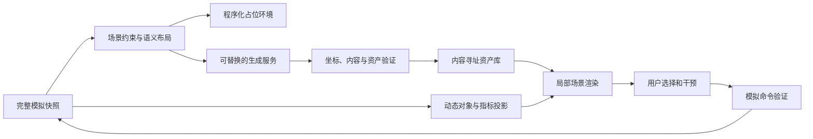

# 世界模型与逼真场景开发方案

- 版本：设计草案 0.1，2026-09-06。
- 状态：后续开发方案，尚未接入生成服务或完成逼真场景原型。
- 上位文档：[项目方案](01-项目方案.md)、[详细设计](02-详细设计.md)。
- 目标：借鉴 World Labs 的空间智能思路，让用户从宇宙、行星概览进入空间连贯、可返回、可观察的局部三维环境，同时保留模拟的因果关系、时间和分支。

## 1. 官方资料与可借鉴范围

以下是本次核对的官方公开信息；产品展示不等于本项目已验证其效果。接口、版本与可用性应在接入时再次核实。

| 来源 | 已公开的信息 | 本项目采用方式 |
| --- | --- | --- |
| [Marble 官方说明](https://www.worldlabs.ai/blog/marble-world-model) | 多模态输入创建、编辑和扩展三维世界，可导出 splats 和网格 | 学习持久空间资产与迭代编辑，优先评估静态环境 |
| [Atlas 官方公告，2026-09-01](https://www.worldlabs.ai/blog/atlas) | 空间上下文结合多模态输入、相机姿态和深度，展示视角生成、重建与时空能力；公告提供早期访问入口 | 借鉴显式空间约束与跨视角一致性；不假定 Atlas 已有通用公开 API 或可本地部署权重 |
| [World API 快速开始](https://docs.worldlabs.ai/api) | 异步生成任务、状态查询、场景资产；示例含 SPZ 精度档和碰撞网格 | 采用服务适配层与异步资产管线，逐字段核对接口 |
| [API 获取世界接口](https://docs.worldlabs.ai/api/reference/worlds/get) | 提供场景资产与元数据 | 导入时校验尺度、坐标与资产清单，不依赖返回字段永远齐全 |
| [Marble 导出规格](https://docs.worldlabs.ai/marble/export/specs) | 网页产品的导出类型与坐标转换说明 | 网页导出和 API 能力分别测试，不假定同等支持高质量网格或所有格式 |
| [Spark 官方文档](https://sparkjs.dev/docs/) | 基于 Three.js 的 Gaussian splat 渲染工具 | 作为现有 Three.js 项目的候选渲染适配器，先验证兼容性 |

本项目不计划训练一个同规模基础模型，也不假定外部模型具备守恒、确定性回放、真实生态或文明推演能力。借鉴重点是：空间上下文、持久世界表示、精确镜头、按需补全、可导出资产。

## 2. 产品体验与第一个场景

入口保持“宇宙总览 → 星球 → 选中区域”，新增“进入局部场景”。第一版只制作一个限定范围、可走动的海岸岩地样板，包含岩石、水面、地表和环境光照；暂不加入森林、动物或聚落，因为当前生命模型不能支持这些实体的真实存在。

用户在局部场景中旋转、行走、点选语义对象，观察温度和生命分布投影；返回星球后仍处于同一分支和完整时间步。同一历史快照再次进入，应出现同一场景，而不是重新抽取一个外观。

20,480 网格下一个区域仍有约数万平方千米，不能直接从一个格子的平均温度推断每块岩石的位置。局部样板建议选取约 256 m × 256 m 的代表性窗口，标注“模型补全的局部样景”；大小是工程试验参数，不是已测覆盖能力。后续真实地球场景再使用带来源的 DEM、影像或现场采集约束。

## 3. 模拟、空间与外观的分工

| 层 | 权威数据 | 可以决定什么 |
| --- | --- | --- |
| 模拟状态 | 环境、资源、谱系、整数时间、干预和分支 | 生物是否存在、物质能量变化、事件是否发生 |
| 空间语义 | 地块、对象 ID、坐标、边界、可行走面、来源 | 场景对象与模拟实体的映射及可交互范围 |
| 外观资产 | 网格、splats、贴图、材质、光照方案 | 在约束内补足视觉细节，不增加模拟事实 |

以现有核心状态为唯一演化真值。生成图像里出现一棵树，不应自动计入生物量；用户想让树成为真实可演化实体时，必须先有相应模型、资源成本和明确干预。易经、佛经等哲学视角可影响解释或选定美术主题，不自动改变科学层规则。

流程建议：

生成输出不直接写回状态数组，也不成为碰撞、数量或营养收支的依据。静态 splat 不应被当作语义齐全、可编辑的物体系统。

## 4. 数据合同与坐标

后续新增独立的 `SceneManifest`，不把大体积视觉资产塞进现有 100 MB 生态 JSON。

| 字段组 | 拟保存内容 |
| --- | --- |
| 身份与锚点 | sceneId、sceneRevision、worldId、branchId、tick、stateHash、rulesetHash |
| 区域关系 | 网格层级、稳定 tileKey、所属 cellIds、父子映射；不把细分前后的裸 cellId 当成同一位置 |
| 空间标定 | 球面锚点、局部东/北/上基底、metersPerUnit、坐标变换矩阵、有效包围盒 |
| 生成约束 | constraintHash、语义布局版本、气候区间、允许/禁止实体、用户美术设定 |
| 资产来源 | provider、实际 modelId、任务 ID、输入材料摘要、生成时间、许可元数据 |
| 资产清单 | 内容 hash、长度、MIME、LOD、相对路径、是否需要外部服务；临时 URL 仅作下载地址 |
| 时间有效性 | validFromTick、可选 validUntilTick、触发失效的条件、替代版本引用 |
| 真实性 | observed / derived / authored / generated；每个可交互对象的证据类别 |

局部物理和交互使用米制坐标，宇宙概览仍采用自己的大尺度单位。大坐标使用分块原点，进入局部场景后转为相对坐标，避免浮点抖动。外部场景的轴向、尺度和地面高度必须经标定测试；不能凭看起来大小合适就接入。

资源池与区域统计允许多对一映射，但某个外观岩石若无真实资源实体，面板应说明其为布景。生命粒子可代表若干个体，必须显示聚合数量，不能虚构每个粒子的独立历史。

## 5. 生成与持久化管线

1. 在完整 tick 边界提取只读场景上下文；生成过程中生态可以继续，任务始终绑定原快照。
2. 先生成程序化语义布局和低模占位场景，提供立即可用的观察界面。
3. 用户明确发起生成后，服务适配器把布局、参考图和约束转为供应商支持的输入。约束提示词不保证合规，输出仍需验证。
4. 保存本地请求 ID 与任务 ID，异步查询完成状态，设定超时、取消和重试策略。供应商未声明幂等时，不因网络响应不确定就重复提交可能收费的生成请求；先查任务。
5. 下载候选资产，校验 hash、格式、尺度、场景范围和禁止内容；只在目标分支/快照仍匹配时发布，否则存入历史候选库。
6. 发布不可变资产清单，按 LOD 加载；失败保留程序化场景，不阻塞模拟。

缓存键建议含 `state/constraint hash + tileKey + layoutVersion + provider/model + input hashes + generation config`。不含瞬时相机位置：移动镜头只能加载已有数据，不能改变场景。供应商即使接受 seed，也不视为逐位确定；需要重放时加载保存的资产字节，不重新生成。

服务端保存密钥，浏览器只收到受控任务与资产地址；外部生成是未来显式操作，需要用户配置可用账号与费用上限。本次文档工作不调用生成服务、不购买额度、不上传用户材料。按当前实际条款核实参考素材使用、生成物保存和再分发许可，不能从技术可导出推断商业使用权。

## 6. 渲染与交互技术路线

- 远景：沿用球面分析图层，逐步增加地形高度、连续海岸与材质。扩大模拟网格与提高视觉网格分别控制。
- 中景：地形块、实例化植被或岩石与低精度 splat，按屏幕占比切换。植被只在未来模型允许时出现。
- 近景：评估 Spark + Three.js；静态自然环境可用 Gaussian splats，可交互物体使用显式网格、语义 ID 与独立碰撞体。
- 动态内容：水面、生命代表粒子、未来的动物或建筑变化使用引擎驱动对象；不每个 tick 重新生成整片 splat。
- 降级：低精度 splat → 网格占位 → 分析地图。视频漫游可以用于分享，不作为自由点选或碰撞交互的替代品。

splats、碰撞网格和语义布局需互相对齐；特别验证门洞、悬崖、地面穿透和遮挡。透明区域或视角缺失不能仅靠一张正面截图验收。先选择一套加载/渲染方案做对照原型，再决定引入依赖，不同时接入多个未经评估的渲染栈。

## 7. 与时间、干预、分支的关系

正常天气和生命数量变化优先更新动态投影与材质，不改变静态地形资产。地形、海陆或未来土地利用发生语义变化时，标记对应区域资产失效，重建受影响分块；生成尚未完成时显示正确的新状态与占位模型，不能继续用旧景象表示新世界。

回到过去加载该历史绑定的场景版本。分支共享不可变资产引用，发生变化后生成子版本。细分网格继承空间锚点，再重建子格映射；避免突然把同一山体移动到另一个区域。

用户说“把这里变成森林”应拆为两种明确操作：外观构想只保存候选样景；真实改造需要生态模型支持并提交带资源账的干预。不能让生成式编辑绕过物质和生命规则。

## 8. 实施顺序与阶段出口

以下是建议新增的视觉工作包 V1—V5，未开始实施，不替代 P0—P9 已完成记录。

| 阶段 | 交付 | 通过后才推进的条件 |
| --- | --- | --- |
| V1 局部场景合同 | 稳定锚点、SceneManifest、程序化岩岸样板、星球往返 | 相机操作不改状态；旧区域细分后映射可追踪；无外部服务也可运行 |
| V2 资产导入原型 | 用户提供或许可明确的一个 SPZ/GLB 样例、LOD 与缓存 | 三个固定镜头和环绕路线检查通过；资产 hash 固定，缺失时正确降级 |
| V3 生成服务适配 | 一个供应商、异步任务、费用上限、生成后验证 | 超时/失败/重复响应可恢复；旧请求不覆盖新分支；未配置密钥不影响生态 |
| V4 时空一致性 | 历史场景版本、动态对象、干预局部更新 | 回溯与分支复现资产；环境失效触发正确；动态数量与模拟投影一致 |
| V5 场景库扩展 | 原始海岸、火山地貌、未来可用的生态/聚落模板 | 每类有证据标签、性能报告和人工视觉审核；不得把美术进展报作文明模型完成 |

Atlas 作为研究验证候选：先确认账号是否可访问、接口和输出是否满足合同，再比较空间一致性与成本。未开放的能力不进入关键交付路径。

## 9. 验收标准

必须同时有自动测试与人工视觉审核；逼真截图不能代替运行正确性。

| 维度 | 拟验收方法 |
| --- | --- |
| 模拟不变 | 同一起点执行镜头、LOD、生成成功/失败、场景进出后，核心状态与随机流 hash 不变 |
| 资产重放 | 保存、刷新、回溯、导入后命中同一 manifest 与资产 hash；不要求跨 GPU 像素逐位一致 |
| 空间关系 | 样板设置至少 10 个已知锚点，坐标变换往返误差目标 < 1 cm；这是软件变换精度，生成几何重建误差另行测量 |
| 跨视角质量 | 固定 12 个相机位与闭环漫游，检查破洞、漂浮、接缝、重复结构、穿透；标注人工问题并复测 |
| 模型一致 | 空星球不得出现未授权动物、建筑或森林；允许的动态聚合对象与投影数量对应 |
| 时间与分支 | 新景未就绪不显示成已完成；晚到生成任务不覆盖已切换分支；旧分支场景仍可恢复 |
| 交互性能 | 初始目标：1440×1000 本机中位帧率 ≥ 30 FPS，输入响应 P95 < 200 ms；记录机型、渲染器、缓存、资产规模和测量窗口 |
| 资源预算 | 原型建议单块压缩资产 ≤ 50 MB，近景同时驻留 ≤ 2 块；实测 CPU/GPU 占用后再调整，不沿用生态 JSON 的预算作为 GPU 内存结论 |
| 故障与成本 | 缺资产、断网、下载不全、鉴权失败、额度不足均保持模拟可用；显示任务与成本记录，不自动无限重试 |

上述数字是待原型验证的项目目标，不是对 World Labs 产品性能或生成速度的承诺。首次加载分别记录网络传输、解码和上传 GPU 时间；收费、速率限制、模型名称均使用接入时的实际资料。

## 10. 优先决策

下一项建议先做 V1：一块可往返、可点选、有稳定空间身份的程序化海岸。随后用一份已有三维资产完成 V2，再决定是否接入 World API。这样能先验证本项目的坐标、历史和交互合同，让更逼真的生成模型成为可替换的场景来源。
